---

editor_options: 
  markdown: 
    wrap: 72
---

# Prepare Seascapes

Thomas Keggin 2024-05-01

## Load Packages

``` r
# packages
library(terra)
library(tidyverse)
library(lubridate)
library(fs)
library(renv)
```

## Set Parameters

``` r
# climate models to use
climate_models <-
  c("CNRM-ESM2-1",
    "GFDL-ESM4",
    "IPSL-CM6A-LR",
    "MIROC-ES2L",
    "MPI-ESM1-2-LR",
    "NorESM2-MM",
    "UKESM1-0-LL")

# environmental variable directory
dir_climate <-
  "./data/Thomas Keggin Mechanistic Climate Change Project/cmip6_final/SSP585/"

# load in some coastlines for plotting
coastlines <-
  vect("./data/coastlines/gshhg-shp-2.3.7/GSHHS_shp/c/GSHHS_c_L1.shp")
```

## Reef coverage

``` r
# load in the reef extent raster
env_grid <-
  rast("./data/Thomas Keggin Mechanistic Climate Change Project/environmental-grid/global_mask_v2.nc")

# aggregate to 1 degree resolution
env_grid_1 <-
  env_grid |>
  aggregate(fact = 4)

# change intermediate cells to reef habitat as they will have partial reef coverage.
env_grid_1[env_grid_1 > 1] <- 2

# extract cell IDs
env_cell_numbers <-
  env_grid_1

values(env_cell_numbers) <-
  cells(env_cell_numbers)
```

```         
## Warning: [setValues] values were recycled
```

### Isthmus of Panama

``` r
plot(env_grid_1, xlim = c(-90, -70), ylim = c(3, 15), col = c("#A0B9D9","#4162A6"), colNA = "#D9B07E")
```

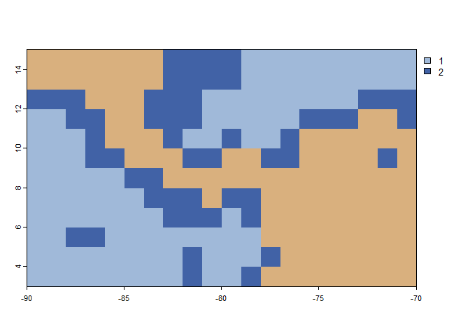<!-- -->

``` r
#text(env_grid_1,
#     labels = cells(env_cell_numbers),
#     cex = 0.5)
```

### Gibraltar Straight

``` r
plot(env_grid_1, xlim = c(-10, -0), ylim = c(30, 40), col = c("#A0B9D9","#4162A6"), colNA = "#D9B07E")
```

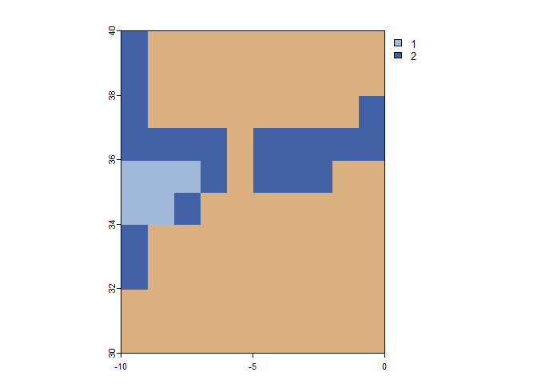<!-- -->

``` r
#text(env_grid_1, labels = cells(env_cell_numbers), cex = 0.5)
```

Looks like it’s closed, to open it:

``` r
env_grid_1[c(19255,19615)] <- 2

plot(env_grid_1, xlim = c(-10, -0), ylim = c(30, 40), col = c("#A0B9D9","#4162A6"), colNA = "#D9B07E")
```

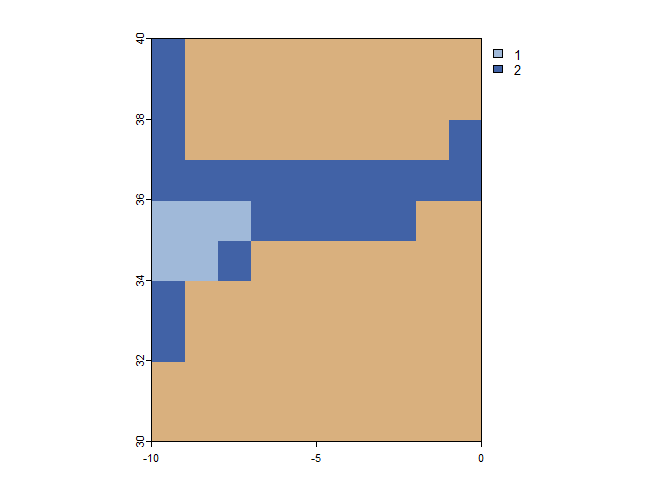<!-- -->

``` r
#text(env_grid_1, labels = cells(env_cell_numbers), cex = 0.5)
```

### Suez Canal

This looks closed so we can leave it.

``` r
plot(env_grid_1, xlim = c(30, 40), ylim = c(22, 33), col = c("#A0B9D9","#4162A6"), colNA = "#D9B07E")
```

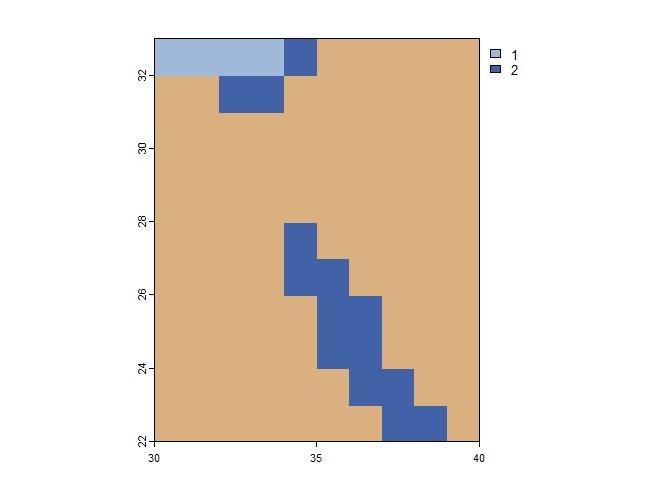<!-- -->

### Bab-el-Mandeb

This is also shut,

``` r
plot(env_grid_1, xlim = c(38, 58), ylim = c(7, 20), col = c("#A0B9D9","#4162A6"), colNA = "#D9B07E")
```

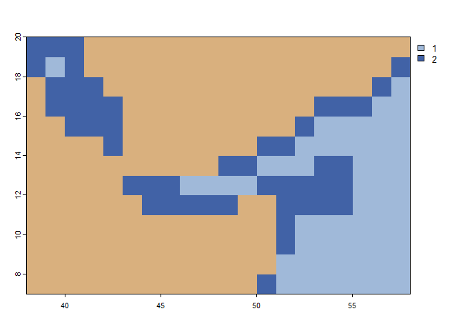<!-- -->

``` r
#text(env_grid_1, labels = cells(env_cell_numbers), cex = 0.5)
```

so we need to open it

``` r
env_grid_1[c(27583,27584)] <-2

plot(env_grid_1, xlim = c(38, 58), ylim = c(7, 20), col = c("#A0B9D9","#4162A6"), colNA = "#D9B07E")
```

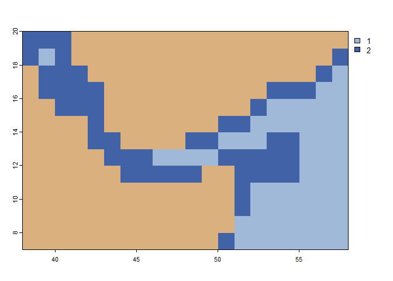<!-- -->

``` r
#text(env_grid_1, labels = cells(env_cell_numbers), cex = 0.5)
```

### Bosphorus

``` r
plot(env_grid_1, xlim = c(16, 42), ylim = c(34, 47), col = c("#A0B9D9","#4162A6"), colNA = "#D9B07E")
```

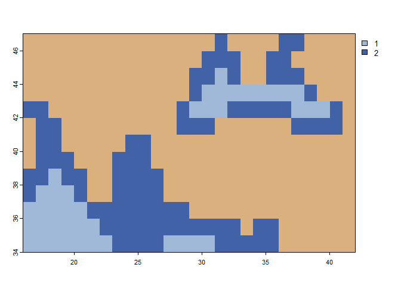<!-- -->

``` r
#text(env_grid_1, labels = cells(env_cell_numbers), cex = 0.4)
```

Insert the Sea of Mamara

``` r
env_grid_1[c(17847,17848)] <-2

plot(env_grid_1, xlim = c(16, 42), ylim = c(34, 47), col = c("#A0B9D9","#4162A6"), colNA = "#D9B07E")
```

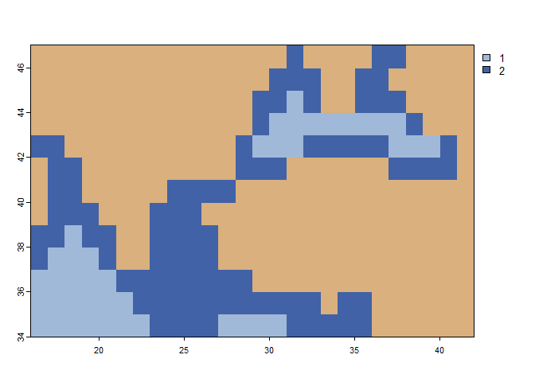<!-- -->

``` r
#text(env_grid_1, labels = cells(env_cell_numbers), cex = 0.4)
```

### Overview

0.25 degree

``` r
plot(env_grid, col = c("#A0B9D9","#4162A6"), colNA = "#D9B07E")
```

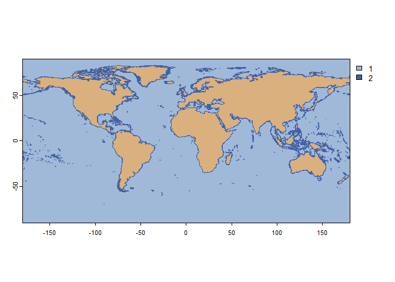<!-- -->

1 degree

``` r
plot(env_grid_1, col = c("#A0B9D9","#4162A6"), colNA = "#D9B07E")
```

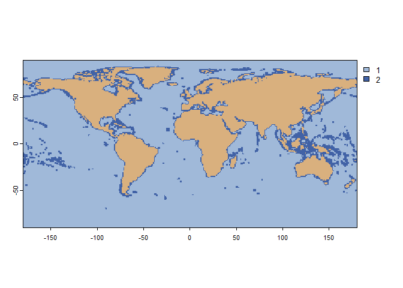<!-- -->

## Load SST

### Load SST (historic)

``` r
sst_historic_monthly <-
  list()

# find and load in the historic SST values
for(climate in climate_models){
  
  historic_dir <-
    paste0(dir_climate,
           climate,"/SSP585_1981_2014/")
  
  historic_files <-
    list.files(historic_dir)
  
  historic_sst_file <-
    historic_files[grep("sst",historic_files)]
  
  sst_historic_monthly[[climate]] <-
    rast(paste0(historic_dir,
                historic_sst_file))
  
}
```

### Load SST (projection)

``` r
sst_projection_monthly <-
  list()

# treating NorESM2-MM diffrently as SST is stored in different time bands
for(climate in climate_models[-grep("NorESM2-MM",climate_models)]){
  
  projection_dir <-
    paste0(dir_climate,
           climate,"/SSP585_2015_2100/")
  
  projection_files <-
    list.files(projection_dir)
  
  projection_sst_file <-
    projection_files[grep("sst",projection_files)]
  
  sst_projection_monthly[[climate]] <-
    rast(paste0(projection_dir,
                projection_sst_file))
  
}

# and now for NorESM2-MM
nor_proj <-
  list()

projection_dir <-
  paste0(dir_climate,
         "NorESM2-MM/")

for(band in c("SSP585_2015_2040/",
              "SSP585_2041_2070/",
              "SSP585_2071_2100/")) {
  
  band_dir <-
    paste0(projection_dir,
           band)
  
  band_files <-
    list.files(band_dir)
  
  band_sst_file <-
    band_files[grep("sst",band_files)]
  
  nor_proj[[band]] <-
    rast(paste0(projection_dir,
                band,
                band_sst_file))
  
}

# combine all projections
sst_projection_monthly[["NorESM2-MM"]] <-
  c(nor_proj[[1]],
    nor_proj[[2]],
    nor_proj[[3]])
```

# Combine SST (historic and projected)

Put them together to make a continuous time series from 1984 to 2100.

``` r
par(mfrow=c(3,3))

sst_monthly <-
  list()

for(climate in climate_models){
  
  sst_monthly[[climate]] <-
    append(sst_historic_monthly[[climate]],
           sst_projection_monthly[[climate]])
  
  plot(sst_monthly[[climate]][[1]])
}
```

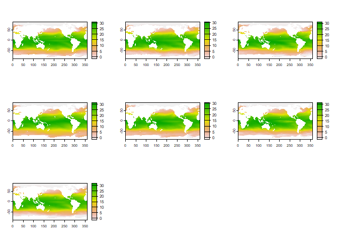<!-- -->

# Reproject SST

``` r
par(mfrow=c(3,3))

sst_monthly_projected <-
  list()

# reproject
for(climate in climate_models){
  
  sst_monthly_projected[[climate]] <-
    terra::project(sst_monthly[[climate]],
                   env_grid_1)
  
  plot(sst_monthly_projected[[climate]][[1]])
  
}
```

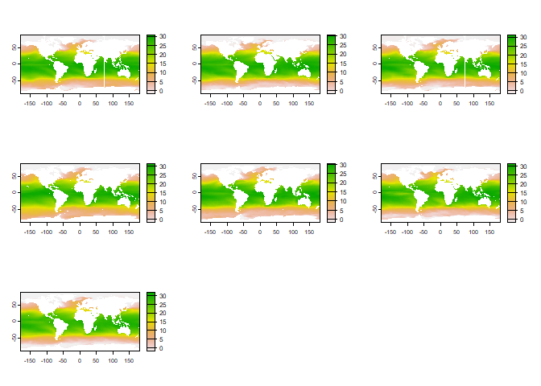<!-- -->

# Extrapolate SST in-land

``` r
par(mfrow=c(3,3))

sst_monthly_projected_extrapolated <-
  list()

for(climate in climate_models){
  
  sst_monthly_projected_extrapolated[[climate]] <-
    terra::focal(sst_monthly_projected[[climate]],
                 w = 3,
                 fun = "mean",
                 na.policy = "only")
  
  plot(sst_monthly_projected_extrapolated[[climate]][[1]])
  
}
```

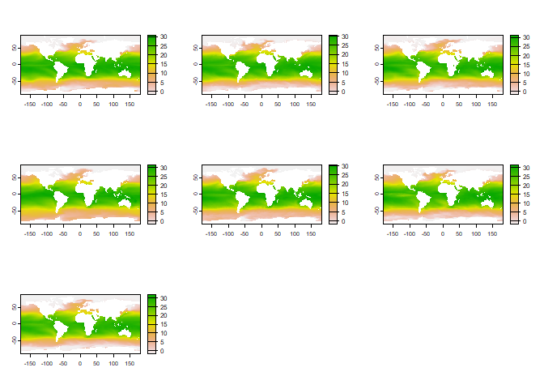<!-- -->

# Combine climate models

``` r
sst_monthly_projected_extrapolated_combined <-
  mean(sst_monthly_projected_extrapolated[[1]],
       sst_monthly_projected_extrapolated[[2]],
       sst_monthly_projected_extrapolated[[3]],
       sst_monthly_projected_extrapolated[[4]],
       sst_monthly_projected_extrapolated[[5]],
       sst_monthly_projected_extrapolated[[6]],
       sst_monthly_projected_extrapolated[[7]],
       na.rm = T)

plot(sst_monthly_projected_extrapolated_combined[[1]])
```

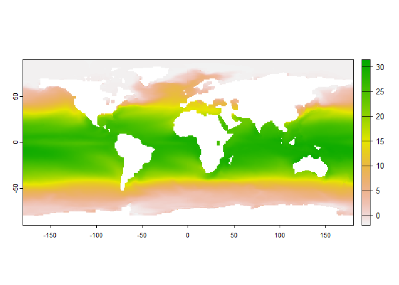<!-- -->

# Apply the reef mask

1.  Create the reef mask.

``` r
# remove pelagic cells to create the reef mask
reef_mask <-
  env_grid_1

reef_mask[reef_mask == 1] <-
  NA

# plot to check
plot(reef_mask)
```

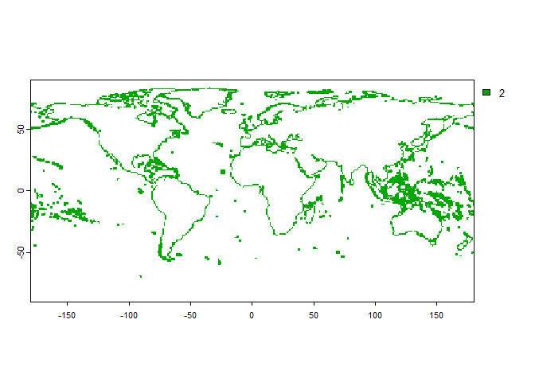<!-- -->

2.  Apply the reef mask.

``` r
sst_monthly_projected_extrapolated_combined_reef <-
  mask(sst_monthly_projected_extrapolated_combined,
       reef_mask)

plot(coastlines)
plot(sst_monthly_projected_extrapolated_combined_reef[[1]],
     add=T)
```

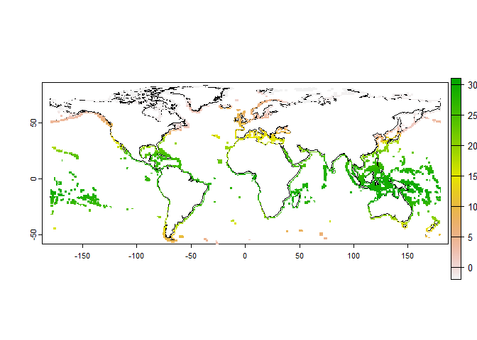<!-- -->

# Quality control

## Remove data deficient cells

``` r
reef_check <-
  env_grid_1

reef_check[!is.na(sst_monthly_projected_extrapolated_combined_reef[[1]])] <- 100

plot(reef_check, col = c("lightgrey","black","grey"),
     main = "cells with no SST")
```

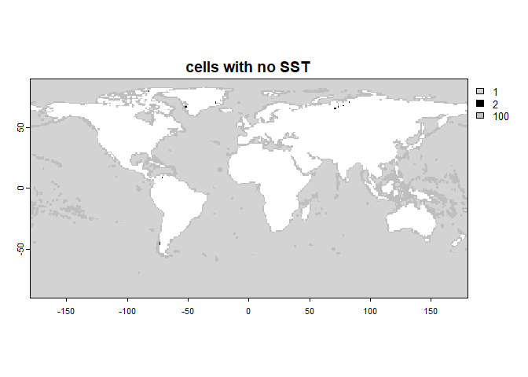<!-- -->

``` r
habitable_seascape <-
  env_grid_1

habitable_seascape[reef_check == 2] <- NA

plot(habitable_seascape, col = c("lightgrey","black","grey"),
     main = "cells with no SST")
```

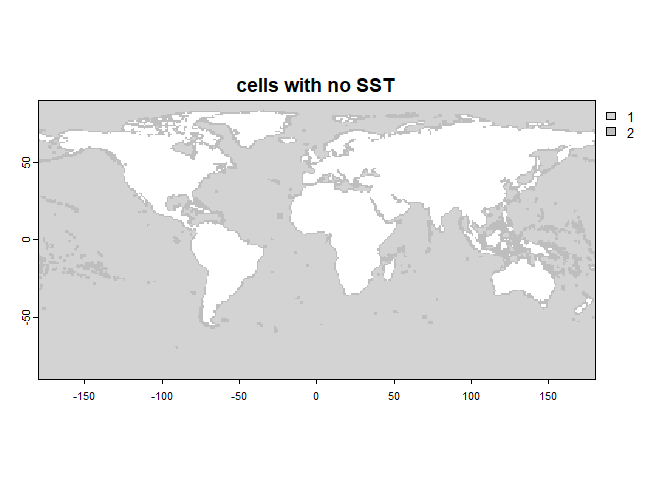<!-- -->

## Remove isolated cells

Remove marine cells that are disconnected with the rest of the ocean.

``` r
# find patches
marine_patches <-
  terra::patches(habitable_seascape,
                 directions = 8)

# There are 23 isolated cells.
table(values(marine_patches$patches))
```

```         
## 
##     1     3     5     8    11    12    14    18    19    21 
## 49190     4     2     1     1     5     1     7     1     1
```

``` r
plot(marine_patches,
     main = "disconnnected ocean patches")
```

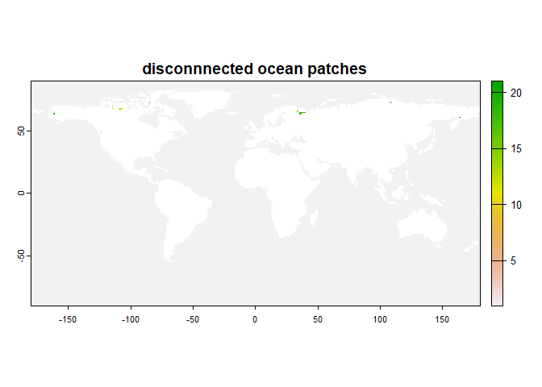<!-- -->

Now we remove the cells and check.

``` r
habitable_seascape[marine_patches != 1] <- NA

marine_patches_removed <-
  terra::patches(habitable_seascape,
                 directions = 8)

table(values(marine_patches_removed$patches))
```

```         
## 
##     1 
## 49190
```

``` r
plot(marine_patches_removed,
     main = "disconnnected ocean patches")
```

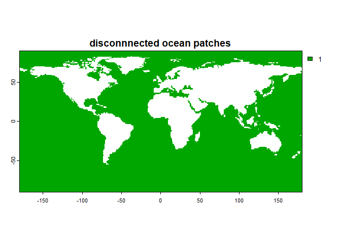<!-- -->

## Apply QC mask to SST

``` r
par(mfrow=c(2,1))

sst_monthly_projected_extrapolated_combined_reef_qc <-
  sst_monthly_projected_extrapolated_combined_reef


sst_monthly_projected_extrapolated_combined_reef_qc[is.na(habitable_seascape)] <-
  NA
```

# Temporal aggregation for seascape object

``` r
sst_annual <-
  list()

sst_annual$mean <-
  tapp(sst_monthly_projected_extrapolated_combined_reef_qc,
       index = "years",
       fun = "mean")

sst_annual$min <-
  tapp(sst_monthly_projected_extrapolated_combined_reef_qc,
       index = "years",
       fun = "min")

sst_annual$max <-
  tapp(sst_monthly_projected_extrapolated_combined_reef_qc,
       index = "years",
       fun = "max")
```

# Convert to Gen3sis format

## Annual

``` r
# extract years
years <-
  names(sst_annual$mean)

# convert to a list of data frames
seascapes <-
  list(
    
    sst_mean = sst_annual$mean |>
      as.data.frame(xy = TRUE, na.rm = FALSE),
    
    sst_min = sst_annual$min |>
      as.data.frame(xy = TRUE, na.rm = FALSE),
    
    sst_max = sst_annual$max |>
      as.data.frame(xy = TRUE, na.rm = FALSE)
  )

# non-automatically set row.names
# see troubleshoot_inputs for why.
for(i in names(seascapes)){
  row.names(seascapes[[i]]) <-
    as.character(row.names(seascapes[[i]]))
}

# reverse year column order
for(i in names(seascapes)){
  
  seascapes[[i]] <-
    cbind(seascapes[[i]][,1:2],seascapes[[i]][,rev(years)])
}

# make sure that the future is still hotter than the past
paste("year 2100:",range(seascapes$sst_min$y_2100, na.rm = T),
      "year 1981:",range(seascapes$sst_min$y_1981, na.rm = T))
```

```         
## [1] "year 2100: -1.89986209074656 year 1981: -1.899924437205"
## [2] "year 2100: 33.2066419389513 year 1981: 29.5086612383525"
```

## Monthly

``` r
# rename frames by month [year_month]
sst_monthly_export <-
  sst_monthly_projected_extrapolated_combined_reef_qc

names(sst_monthly_export) <-
  paste0("y_",
         year(time(sst_monthly_export)),
         "_",
         month(time(sst_monthly_export),
               label = T))

# convert to a list of data frames
sst_monthly_export_df <-
  sst_monthly_export |>
  as.data.frame(xy = TRUE, na.rm = FALSE)

# non-automatically set row.names
# see troubleshoot_inputs for why.
rownames(sst_monthly_export_df) <-
  as.character(rownames(sst_monthly_export_df))

# reverse year column order
sst_monthly_export_df <-
  cbind(sst_monthly_export_df[,1:2],
        sst_monthly_export_df[,rev(names(sst_monthly_export))])


# make sure that the future is still hotter than the past
paste("year 2100:",range(sst_monthly_export_df$`y_2100_Jan`, na.rm = T),
      "year 1981:",range(sst_monthly_export_df$`y_1981_Jan`, na.rm = T))
```

```         
## [1] "year 2100: -1.8997905254364 year 1981: -1.89956152439117"
## [2] "year 2100: 35.030432510376 year 1981: 31.0561918258667"
```

# Export

``` r
# gen3sis
saveRDS(seascapes,
        "./data_processed/seascapes/landscapes.rds")

# monthly sst for species traits (as rds to preserve non-auto rownames booo)
saveRDS(sst_monthly_export_df,
        "./data_processed/seascapes/monthly_sst.rds")

# habitable seascapes raster
writeRaster(habitable_seascape,
            "./data_processed/seascapes/marine_raster.tiff")
```
