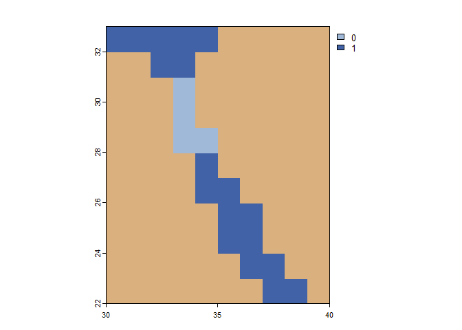

# Prepare Distance Matrices

Thomas Keggin 2024-05-01

## Set

``` r
library(terra)
library(gdistance)
library(ggplot2)
```

## Load

``` r
# reefs
marine_cells <-
  rast("./data_processed/seascapes/marine_raster.tiff")

# cell IDs
env_cell_numbers <-
  marine_cells

values(env_cell_numbers) <-
  cells(env_cell_numbers)

# gen3sis seascape
seascape_gen <-
  readRDS("./data_processed/seascapes/landscapes.rds")
```

## Extract habitable cells

``` r
habitable_cells <-
  marine_cells

# remove pelagic cells
habitable_cells[habitable_cells == 1] <- NA
```

## Create raster of per-cell cost distances

Values of 1 have no penalty. Values of 0 are uncrossable, as are NA values.

``` r
cost_rast <-
  marine_cells

cost_rast[!is.na(cost_rast)] <- 1
```

Make the Suez partially crossable

``` r
plot(cost_rast, xlim = c(30, 40), ylim = c(22, 33), col = c("#A0B9D9","#4162A6"), colNA = "#D9B07E")
text(env_cell_numbers, labels = cells(env_cell_numbers), cex = 0.4)
```

``` r
cost_rast[c(22174,21814,21454,22175)] <- 0.015
plot(cost_rast, xlim = c(30, 40), ylim = c(22, 33), col = c("#A0B9D9","#4162A6"), colNA = "#D9B07E")
```

<!-- -->

## Generate transition object

``` r
# convert to raster
cost_raster <-
  raster::raster(cost_rast)

# calculate transition object
cost_trans <-
  gdistance::transition(cost_raster,
                        transitionFunction = mean,
                        directions = 8)
```

```         
## The extent and CRS indicate this raster is a global lat/lon raster. This means that transitions going off of the East or West edges will 'wrap' to the opposite edge.

## Global lat/lon rasters are not supported under new optimizations for 4 and 8 directions with custom transition functions. Falling back to old method.
```

``` r
# correct for cell area differences
cost_trans_corrected <-
  geoCorrection(cost_trans,
                type = "r",
                multpl=FALSE)
```

## Explore transition object.

``` r
# points of interest
black_sea <-
  SpatialPoints(data.frame(x=39,y=42))

iceland <-
  SpatialPoints(data.frame(x=-24,y=63))

galapagos <-
  SpatialPoints(data.frame(x=-90,y=-1))

sri_lanka <-
  SpatialPoints(data.frame(x=78,y=7))

sharm <-
  SpatialPoints(data.frame(x=34,y=27))

madagascar <-
  SpatialPoints(data.frame(x=42,y=-15))

# paths of interest
path_iceland <- 
  shortestPath(x = cost_trans_corrected,
               origin = black_sea,
               goal = iceland,
               output = "SpatialLines")

path_galapagos <- 
  shortestPath(x = cost_trans_corrected,
               origin = black_sea,
               goal = galapagos,
               output = "SpatialLines")

path_sri_lanka <- 
  shortestPath(x = cost_trans_corrected,
               origin = black_sea,
               goal = sri_lanka,
               output = "SpatialLines")

path_madagascar <- 
  shortestPath(x = cost_trans_corrected,
               origin = black_sea,
               goal = madagascar,
               output = "SpatialLines")

path_sharm <- 
  shortestPath(x = cost_trans_corrected,
               origin = black_sea,
               goal = sharm,
               output = "SpatialLines")

# plot
plot(marine_cells, col = c("#A0B9D9","#4162A6"), colNA = "#D9B07E")
lines(path_iceland, col = "#A60311", lwd = 2)
lines(path_galapagos, col = "#A60311", lwd = 2)
lines(path_sri_lanka, col = "#A60311", lwd = 2)
lines(path_sharm, col = "#A60311", lwd = 2)
lines(path_madagascar, col = "#A60311", lwd = 2)
```

<!-- -->

``` r
#plot(marine_cells, xlim = c(16, 42), ylim = c(34, 47), col = c("#A0B9D9","#4162A6"), colNA = "#D9B07E")
#text(env_cell_numbers, labels = cells(env_cell_numbers), cex = 0.4)

# create test raster
cost_test <-
  cost_rast

cost_test[16779] <- -1

cost_test[cost_test == 0.015] <- 30

plot(costDist(cost_test, target=-1, scale = 5)) 
lines(path_iceland, col = "#A60311", lwd = 2)
lines(path_galapagos, col = "#A60311", lwd = 2)
lines(path_sri_lanka, col = "#A60311", lwd = 2)
lines(path_sharm, col = "#A60311", lwd = 2)
lines(path_madagascar, col = "#A60311", lwd = 2)
```

<!-- -->

## Calculate distance matrices

``` r
# create habitable cells spatial points
hab_df <-
  as.data.frame(habitable_cells, xy = T) |>
  dplyr::filter(!is.na(layer))

hab_df <-
  hab_df |>
  dplyr::mutate(cell_id = 1:dim(hab_df)[1])

hab_sp <-
  SpatialPoints(hab_df,
                proj4string = crs(cost_raster))

# calculate distance matrix between all habitable cells
dist_mat <-
  gdistance::costDistance(x = cost_trans_corrected,
                          fromCoords = hab_sp,
                          toCoords = hab_sp)
```

## Cell IDs

``` r
# assign cell IDs to distance matrix
rownames(dist_mat) <-
  rownames(seascape_gen$sst_mean)[which(!is.na(seascape_gen$sst_mean[,3]))]

colnames(dist_mat) <-
  rownames(dist_mat) 
```

## Export

### Distance matrices

``` r
years <-
  colnames(seascape_gen$sst_mean)[grep("y_",colnames(seascape_gen$sst_mean))]

# save the first one
saveRDS(dist_mat,
        paste0("./data_processed/seascapes/distances_full/distances_full_",0,".rds"))

# copy and paste (faster than a loop outputting the same distance matrix)
for(year in 1:(length(years)-1)){
  
  file.copy(from = paste0("./data_processed/seascapes/distances_full/distances_full_",0,".rds"),
            to   = paste0("./data_processed/seascapes/distances_full/distances_full_",year,".rds"))
  
}
```

### Seascape object

``` r
saveRDS(seascape_gen,
        "./data_processed/seascapes/landscapes.rds")
```
